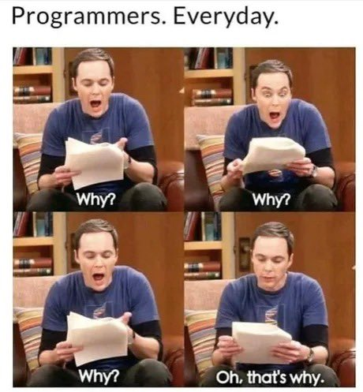
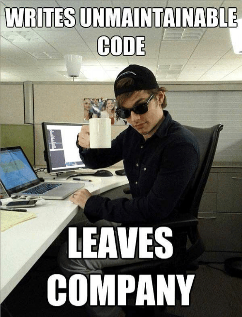
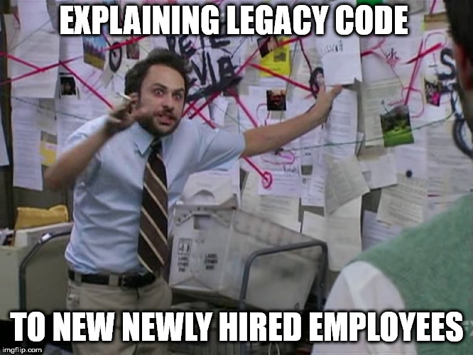

% Rewriting software without spending millions
% Daniel Rotter

# Disclaimer

##



##



##



# Initial Situation

##


## Problems

- No clear architecture
- Old and nowadays unpopular framework
- Almost no tests
- Almost no static analysis tools
- Duplicated queries and business logic among repositories
- Hard to change database schema
- Some deployments are done manually using `git`
- Code would be written differently today

# Target Architecture

## Microservices

- High cohesion & low coupling
- Each microservice has its own database

## Extract Product Lines

- Products lines are rather static
- Changing scope of microservices is expensive
- Identify shared functionality

##


##

> We won't get approval from management to spend millions on a rewrite

## Feature-Driven Refactoring

Try to build new features or complex bug fixes in the target architecture

## Case Study

Moving indexing of documents away from web server

## Current implementation

- Legacy system writes index jobs into a database table
- Cronjob periodically calls index endpoint in legacy system
- Index endpoint reads information from index job table
- Index endpoint transforms documents to JSON
- Index endpoint inserts JSON into OpenSearch cluster in bulk

## Goals

- Use the modern Symfony framework
- Introduce proper classes instead of arrays
- Avoid duplicated queries among repositories
- Use deptrac to define architectural rules
- Statically analyse the code
- Automatically format code
- Have a 100% test coverage
- No big bang rewrite
- No data migration (for now)

## Legacy Seam

A place where you can alter behavior without editing in that place

## Legacy Seam

```php
<?php

class Foo
{
    public function __construct(private readonly BarInterface $bar) {}

    public function doSomething()
    {
        $this->bar->baz();
    }
}
```

## Legacy Seam


## Transitional Architecture

Software elements easing the displacement of a legacy system being removed when the displacement is complete

##


##


## Achievements

- Used a modern framework
- Introduced a proper domain model
- Used old database to avoid data migration
- Queries are implemented once in a repository class
- Added automatic checks of architectural constraints
- Added static analysis of code
- Added automatic code formatting
- 100% test coverage
- No big bang rewrite
- Deployment using Docker containers
- Complete local development environment working offline

## Outlook

- Try finding more opportunities to develop functionality in the target architecture
- Define new database schemas
- Migrate data to new database schemas

## Thank you!

danielrotter.at  
www.linkedin.com/in/rotter-daniel/  
mastodon.social/@danrot  
bsky.app/profile/danielrotter.at  
